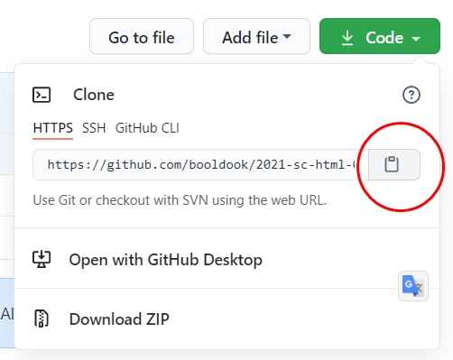

# git 을 설치하자
## 1. git을 로컬컴퓨터에 설치하기
[git-scm](https://git-scm.com) 사이트에서 **git설치파일**을 다운로드한다.

## 2.로컬컴퓨터에서 **한번만** 해야될 작업
```bash

# github id
git config -- global user.name 'booldook'

# github email
git config -- global user.email 'booldook@gmail.com'
```
## 3. 다른사람의 git가져오기
```bash
git clone https://github.com/booldool/2021-sc-html-05-flex-git
```



<!-- ```html
<!DOCTYPE html>
<html lang="ko">
<head>
	<meta charset="UTF-8">
	<meta http-equiv="X-UA-Compatible" content="IE=edge">
	<meta name="viewport" content="width=device-width, initial-scale=1.0">
	<title>Document</title>
</head>
<body>
	
</body>
</html>
```

```css
html, body, h1,h2, h3,h4,h5,h6, p, div, 
header, footer, section, aside, article, 
ul, ol, li, dl, dd, dt {margin: 0; padding: 0;
	box-sizing: border-box;line-height: 1;}

	h1, h2, h3, h4, h5, h6 {font-weight: normal;}
	
/* 글씨와 관련된 것만 상속된다.. 크기는 상속안됨 */
a:link, a:visited, a:hover, a:active {color: inherit; 
	text-decoration: none;}

	/* 영문은 글자 베이스라인 기준이 한글과 다르다 */
	img {vertical-align: middle;}
	
    button {background-color: transparent; border: none;}
    address{font-style: normal;}

    input, select, textarea, button {font-size: inherit; box-sizing: border-box;}
    input:focus, select:focus, textarea:focus {outline: none;}

	.clear::after {display: block; content:"";clear: both;}
	.w100 {width: 100%;}

	``` -->